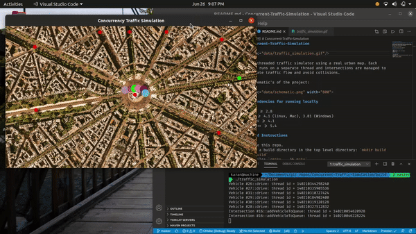
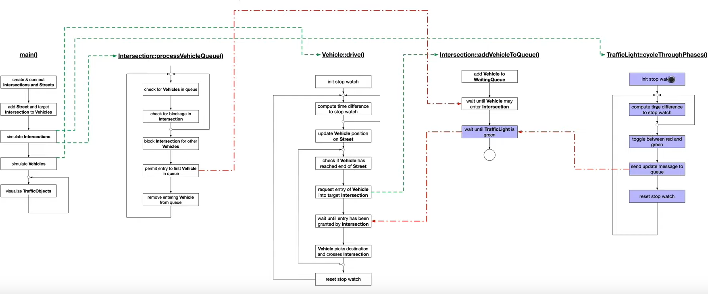

# Concurrent-Traffic-Simulation

A multithreaded traffic simulator using a real urban map. Each vehicle runs on a separate thread and intersections are managed to facilitate traffic flow and avoid collisions.

The schematic's of the project:

## Dependencies for running locally

- cmake >= 2.8
- make >= 4.1 (linux, Mac), 3.81 (Windows)
- OpenCV >= 4.1
- gcc/g++ >= 5.4

## Build Instructions

1. Clone this repo.
2. Make a build directory in the top level directory: `mkdir build && cd build`
3. Compile: `cmake .. && make`
4. Run: `./traffic_simulation`
